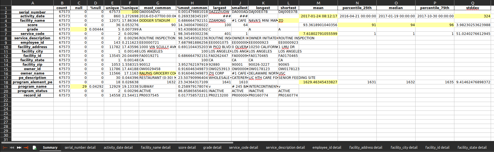
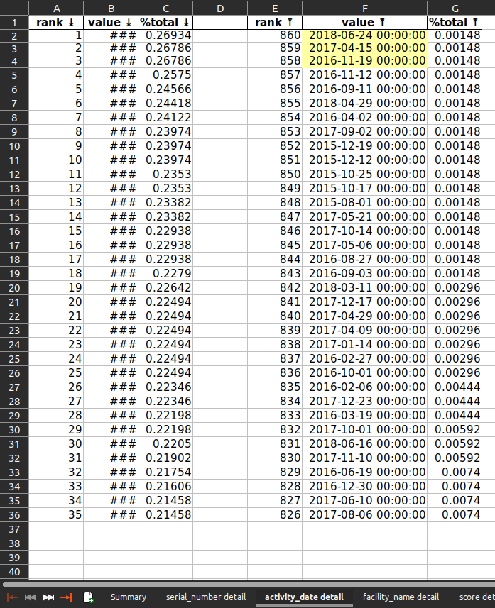
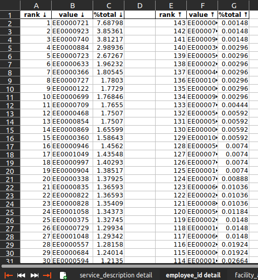
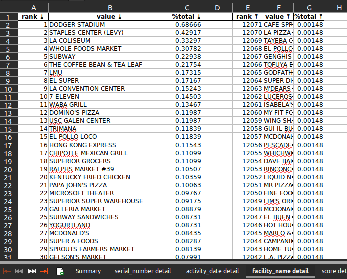
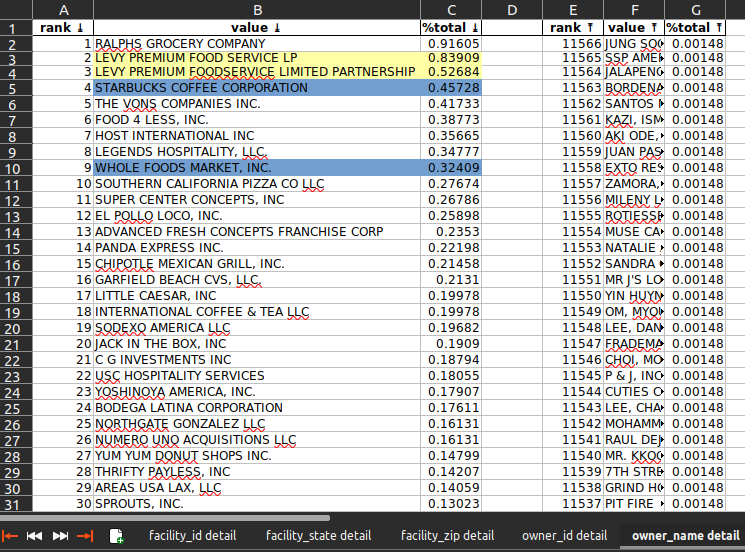
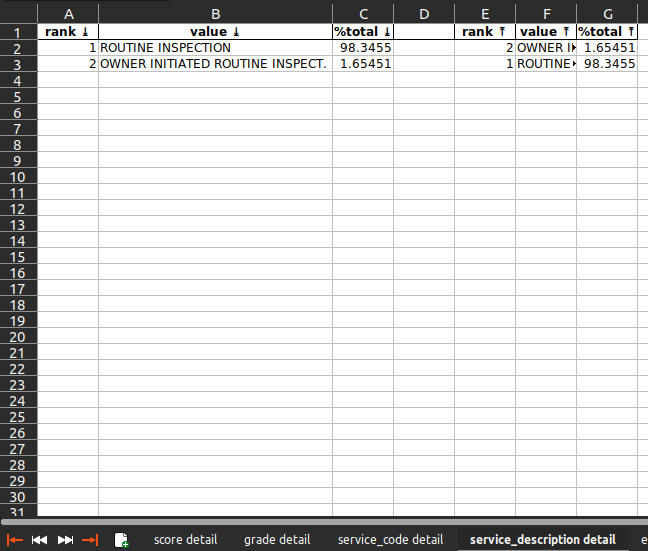

# Author
[Jason Friedman](https://www.linkedin.com/in/jasonfriedmantechnology/) is the author of this code.

# parse-unicode.py
## Overview
I have many times been asked to diagnose cases where data flowing from a source fails to be accepted by a target with an error like:

    codec can't decode bytes in position 2-4

It is sometimes helpful to verify the input data is what we expect.

## Usage
`parse-unicode.py` takes its input from STDIN, or from a file if one is provided as an argument.

All of the examples produce this output (note the multi-byte character `PLUS-MINUS SIGN` at bytes 19 & 20):

    char line_num char_num byte_num character_name
       T        1        0        0 LATIN CAPITAL LETTER T
       h        1        1        1 LATIN SMALL LETTER H
       e        1        2        2 LATIN SMALL LETTER E
                1        3        3 SPACE
       e        1        4        4 LATIN SMALL LETTER E
       r        1        5        5 LATIN SMALL LETTER R
       r        1        6        6 LATIN SMALL LETTER R
       o        1        7        7 LATIN SMALL LETTER O
       r        1        8        8 LATIN SMALL LETTER R
                1        9        9 SPACE
       r        1       10       10 LATIN SMALL LETTER R
       a        1       11       11 LATIN SMALL LETTER A
       t        1       12       12 LATIN SMALL LETTER T
       e        1       13       13 LATIN SMALL LETTER E
                1       14       14 SPACE
       w        1       15       15 LATIN SMALL LETTER W
       a        1       16       16 LATIN SMALL LETTER A
       s        1       17       17 LATIN SMALL LETTER S
                1       18       18 SPACE
       ±        1       19       19 PLUS-MINUS SIGN
       5        1       20       21 DIGIT FIVE
       %        1       21       22 PERCENT SIGN
       ,        1       22       23 COMMA
                1       23       24 CARRIAGE RETURN
       w        2       24       25 LATIN SMALL LETTER W
       h        2       25       26 LATIN SMALL LETTER H
       i        2       26       27 LATIN SMALL LETTER I
       c        2       27       28 LATIN SMALL LETTER C
       h        2       28       29 LATIN SMALL LETTER H
                2       29       30 SPACE
       w        2       30       31 LATIN SMALL LETTER W
       a        2       31       32 LATIN SMALL LETTER A
       s        2       32       33 LATIN SMALL LETTER S
                2       33       34 SPACE
       g        2       34       35 LATIN SMALL LETTER G
       o        2       35       36 LATIN SMALL LETTER O
       o        2       36       37 LATIN SMALL LETTER O
       d        2       37       38 LATIN SMALL LETTER D
                2       38       39 SPACE
       e        2       39       40 LATIN SMALL LETTER E
       n        2       40       41 LATIN SMALL LETTER N
       o        2       41       42 LATIN SMALL LETTER O
       u        2       42       43 LATIN SMALL LETTER U
       g        2       43       44 LATIN SMALL LETTER G
       h        2       44       45 LATIN SMALL LETTER H
                2       45       46 SPACE
       f        2       46       47 LATIN SMALL LETTER F
       o        2       47       48 LATIN SMALL LETTER O
       r        2       48       49 LATIN SMALL LETTER R
                2       49       50 SPACE
       t        2       50       51 LATIN SMALL LETTER T
       h        2       51       52 LATIN SMALL LETTER H
       e        2       52       53 LATIN SMALL LETTER E
       m        2       53       54 LATIN SMALL LETTER M
       !        2       54       55 EXCLAMATION MARK
                2       55       56 CARRIAGE RETURN

### STDIN v.1

    $ python3 parse-unicode.py <<EOF
    > The error rate was ±5%,
    > which was good enough for them!
    > EOF

### STDIN v.2

    $ cat /tmp/example.txt
    The error rate was ±5%,
    which was good enough for them!

    $ cat /tmp/example.txt | python3 parse-unicode.py

### File
    $ cat /tmp/example.txt
    The error rate was ±5%,
    which was good enough for them!
     
    $ python3 parse-unicode.py /tmp/example.txt 

# analyze-quality.py
## Overview
The idea for this code came from my time managing a team of data analysts for an internal audit department of a large company.

The audit team asks the business for certain data and, depending on the prevailing politics of the organization, may eventually receive such data or the permission necessary to extract it.

So, now you've got potentially a lot of data ... where do you tell your auditors to focus? Wouldn't it be helpful to have a program which quickly identifies interesting things? And by interesting I mean either likely incorrect, or likely correct but pointing to a business failure.

That's what this program does.

## Usage
I grabbed sample Los Angeles restaurant inspection data from https://www.kaggle.com.
The URL at that time was https://www.kaggle.com/datasets/cityofLA/la-restaurant-market-health-data. 

### Installation
- `git clone https://github.com/jsf80238/jason_friedman.git`
- `cd jason_friedman`
- `python3 -m venv your_dir`
- `source your_dir/bin/activate`  # or on Windows `your_dir\Scripts\activate.bat`
- `pip install -r requirements.txt`

### Execution
    $ your_dir/bin/python analyze-quality.py -h
    usage: analyze-quality.py [-h] [--header NUM] [--max-detail-values NUM] [-v | -t] input
    
    Analyze the quality of a CSV file.
        
    positional arguments:
      input                 /path/to/file.csv.
    
    options:
      -h, --help            show this help message and exit
      --header NUM          Specify the number of rows to skip for header information.
      --max-detail-values INT 
                            Produce this many of the top/bottom value occurrences, default is 35. (must be in range 1..=1e+99)
      --sample-percent INT  Randomly choose this percentage of the input data and ignore the remainder. (must be in range 1..=99)
      -v, --verbose
      -t, --terse
     
    Generates an Excel workbook containing the analysis.

- Download your data.
- `your_dir/bin/python analyze-quality.py ~/Downloads/restaurant-and-market-health-inspections.csv`
- The results will be an `.xlsx` workbook in your current directory, named the same as the input file (excepting the extension).

### Results
The workbook will contain multiple sheets:
- Summary.
- Detail, one sheet per column in the data source.

This is an example summary:

Let's focus on the highlighted cells.
- C6, C19: these are likely data quality issues. As a percentage of the total data set can be ignored.
- F2: `serial_number` is unique. Good.
- G4: The most common `facility_name` for restaurants is "DODGER_STADIUM". That's odd.
- G16: And yet the most common `owner_name` is Ralph's Grocery CO. Probably https://www.ralphs.com/.
- L4: The shortest `facility_name` is "ZO". Probably a data quality issue.
- M3, Q3: Dates are treated as numeric. They can essentially be thought of as the number of seconds after some date. See also https://www.epochconverter.com/ for Linux. Windows has a [similar concept](https://devblogs.microsoft.com/oldnewthing/20090306-00/?p=18913). 
- N5, O5, P5: 50% of the scores were between 91 and 96.
- M7, M18: the program treats numbers as measurements, even though for these columns the numbers are just IDs. Perhaps more sophisticated code could do better.

Now, details by column.
#### activity_date

- Note the dates with very few inspections (F2, F3, F4 ...). These are Saturdays and Sundays. It makes sense inspectors (city staff) don't work on weekends ... although perhaps for this kind of work they should?

#### employee_id

- One employee among the 143 who performed inspections handled one out of every fourteen inspections. And it was twice as many as the next busiest inspector. Why?

#### facility_name

- Again, "DODGER STADIUM" leads the way. Are there more restaurants in Dodger Stadium than there are Subway restaurants in all of Los Angeles?

#### owner_name

- Note the yellow-highlighted cells. This looks to be a data-quality issue .. Levy Premium Food listed twice. When added together this would be the top owner, not Ralph's.
- Note the blue-highlighted cells. Is true there are only 50% more Starbucks than Whole Foods?

#### service_description

- Only 1.65% of inspections were initiated by the owner. Probably makes sense.
- All inspections are some variation of "routine", apparently.

## Potential improvements
- Read data directly from a database.
- Sample the data for really large datasets.
- Allow the specification of unusual, but known, datetime formats.
- Allow the specification of columns to exclude, or include.
- Generate plots. It is difficult to generate useful plots.
  - For example, you might want a categorical plot for character data, but if the column contains customer names then every name will appear (roughly) one time.
  - Or, you might want a histogram for numeric or datetime data, but if the column is a primary key, or a created timestamp generated by a trigger, then again each value will appear (almost always) one time.

### Code snippets for potential improvements
    filename = "data.txt"
    n = sum(1 for line in open(filename)) - 1 #number of records in file (excludes header)
    s = 10000 #desired sample size
    skip = sorted(random.sample(range(1,n+1),n-s)) #the 0-indexed header will not be included in the skip list
    df = pandas.read_csv(filename, skiprows=skip)
