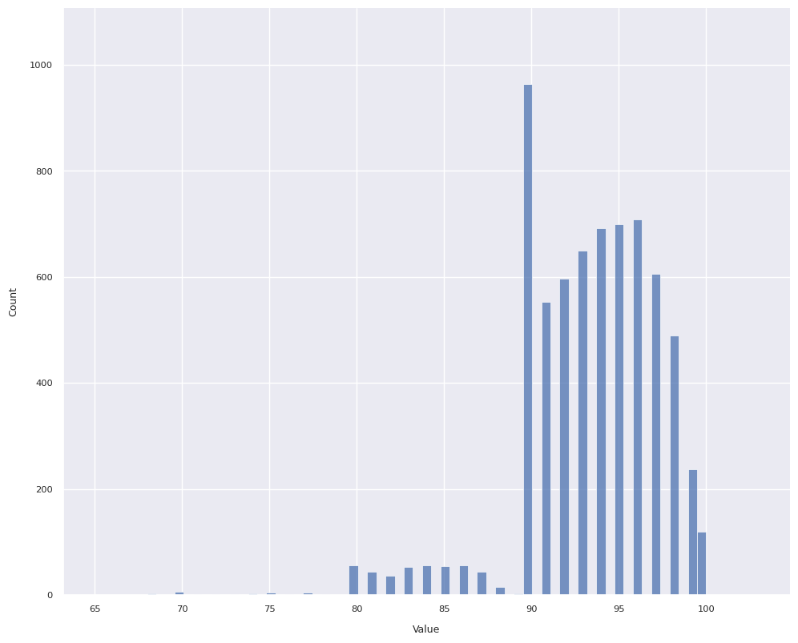
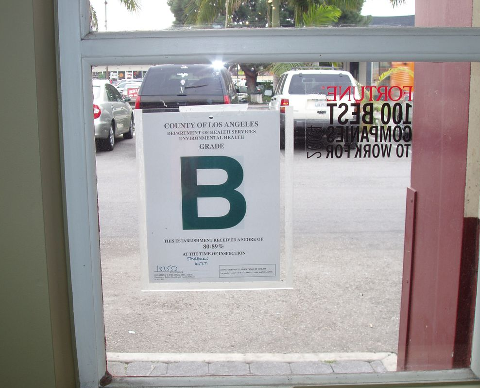
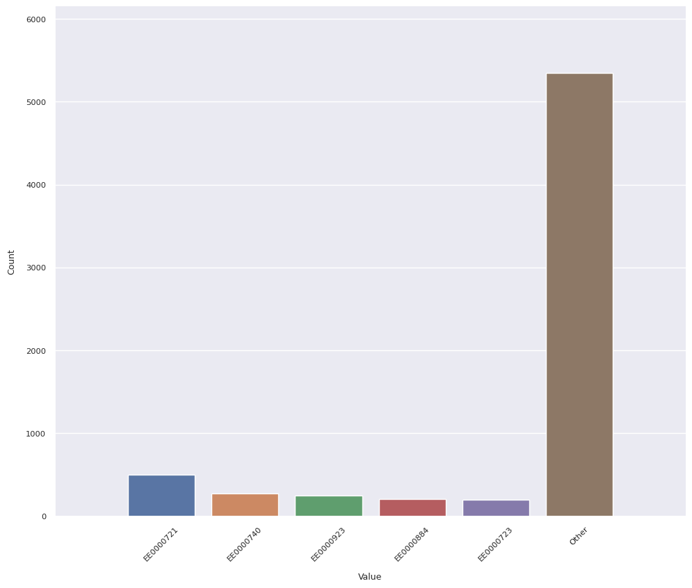

# Author
[Jason Friedman](https://www.linkedin.com/in/jasonfriedmantechnology/) is the author of this code.

# analyze-quality.py
## Overview
The idea for this code came from my time managing a team of data analysts for an internal audit department of a large company.

The audit team asks the business for certain data and, depending on the prevailing politics of the organization, may eventually receive such data or the permission necessary to extract it.

So, now you've got potentially a lot of data ... where do you tell your auditors to focus? Wouldn't it be helpful to have a program which quickly identifies interesting things? And by interesting I mean either likely incorrect, or likely correct but pointing to a business failure.

That's what this program does.

## Usage
I grabbed sample Los Angeles restaurant inspection data from https://www.kaggle.com.
The URL at that time was https://www.kaggle.com/datasets/cityofLA/la-restaurant-market-health-data. 

### Installation
- `git clone https://github.com/jsf80238/jason_friedman.git`
- `cd jason_friedman`
- `python3 -m venv your_dir`
- `source your_dir/bin/activate`  # or on Windows `your_dir\Scripts\activate.bat`
- `pip install -r requirements.txt`

### Execution
    $ your_dir/bin/python analyze-quality.py -h
    usage: analyze-quality.py [-h] [--header NUM] [--max-detail-values INT] [--sample-percent INT] [--no-plot] [-v | -t] input
    
    Profile the data in a CSV file.
    
    positional arguments:
      input                 /path/to/file.csv
    
    options:
      -h, --help            show this help message and exit
      --header NUM          Specify the number of rows to skip for header information.
      --max-detail-values INT
                            Produce this many of the top/bottom value occurrences, default is 35. (must be in range 1..=1e+99)
      --sample-percent INT  Randomly choose this percentage of the input data and ignore the remainder. (must be in range 1..=99)
      --no-plot             Don't generate plots.
      -v, --verbose
      -t, --terse
    
    Generates an analysis consisting of an Excel workbook and (optionally) one or more images.

- Download your data.
- `your_dir/bin/python analyze-quality.py ~/Downloads/restaurant-and-market-health-inspections.csv`
- The results will be an `.zip` archive in your current directory, named the same as the input file (excepting the extension).

### Results
The program generates a zip file containing:
- Excel workbook containing multiple sheets:
  - Summary.
  - Detail, one sheet per column in the data source.
- Images folder:
  - One image per column, either a categorical plot or distrbution plot depending on which the program thinks would be most helpful.

This is an example summary:

Let's focus on the highlighted cells.
- C6, C19: these are likely data quality issues. As a percentage of the total data set can be ignored.
- F2: `serial_number` is unique. Good.
- G4: The most common `facility_name` for restaurants is "DODGER_STADIUM". That's odd.
- G16: And yet the most common `owner_name` is Ralph's Grocery CO. Probably https://www.ralphs.com/.
- L4: The shortest `facility_name` is "ZO". Probably a data quality issue.
- M3, Q3: Dates are treated as numeric. They can essentially be thought of as the number of seconds after some date. See also https://www.epochconverter.com/ for Linux. Windows has a [similar concept](https://devblogs.microsoft.com/oldnewthing/20090306-00/?p=18913). 
- N5, O5, P5: 50% of the scores were between 91 and 96.
- M7, M18: the program treats numbers as measurements, even though for these columns the numbers are just IDs. Perhaps more sophisticated code could do better.

Now, details by column.
#### score

- As a first estimate I would have guessed this would look like a Bell curve, perhaps with a bit of [skew](https://www.itl.nist.gov/div898/handbook/eda/section3/eda35b.htm).
- Instead, we many more scores of 90 than expected and much fewer scores of 89 than expected (and fewer in the 80s than expected).
- Without proof I would guess:
  - A score of 90-100 yields a sign in the restaurant window with the letter A.
  - A score of 80-99 yields a sign in the restaurant window with the letter B.
  - People don't like to eat at restaurants which fail to achieve a A-rating.
  - Restaurant owners, and to a lesser extent restaurant inspectors, strive to avoid anything other than a A-rating. (Image below courtesy of https://la.eater.com/2015/8/19/9178907/la-county-health-department-restaurant-grades-need-overhaul.)

#### employee_id

- One employee (EE0000721) among the 143 who performed inspections handled one out of every fourteen inspections. And it was twice as many as the next busiest inspector. Why?

#### activity_date

- Note the dates with very few inspections (F2, F3, F4 ...). These are Saturdays and Sundays. It makes sense inspectors (city staff) don't work as much on weekends.

#### facility_name

- Again, "DODGER STADIUM" leads the way. Are there more restaurants in Dodger Stadium than there are Subway restaurants in all of Los Angeles?

#### owner_name

- Note the yellow-highlighted cells. This looks to be a data-quality issue .. Levy Premium Food listed twice. When added together this would be the top owner, not Ralph's.
- Note the blue-highlighted cells. Is true there are only 50% more Starbucks than Whole Foods?

#### service_description

- Only 1.65% of inspections were initiated by the owner. Probably makes sense.
- All inspections are some variation of "routine", apparently.

## Potential improvements
- Read data directly from a database.
- Allow the specification of unusual, but known, datetime formats.
- Allow the specification of columns to exclude, or include.
- Generate better plots. It is difficult to generate useful plots.
  - For example, you might want a categorical plot for character data, but if the column contains customer names then every name will appear (roughly) one time.
  - Or, you might want a histogram for numeric or datetime data, but if the column is a primary key, or a created timestamp generated by a trigger, then again each value will appear (almost always) one time.
  - Allow the caller to specify plot visual effects.